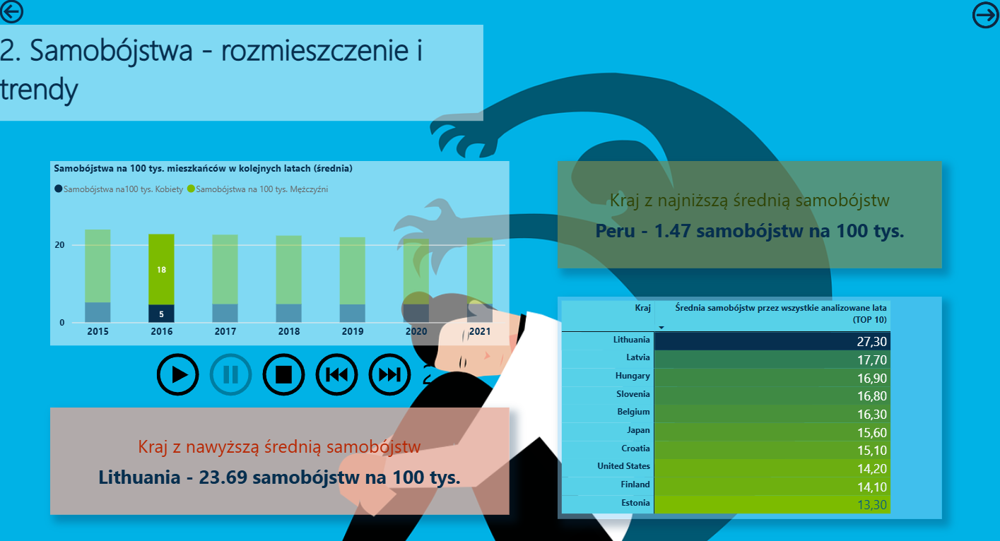

## Hi there 👋

I'm Julia – aspiring Data Analyst

I’m a recent graduate in Business Analytics with a passion for turning data into actionable insights.  
Currently building a portfolio of projects that combine data wrangling, visualization, and machine learning.
I love finding patterns in messy data and helping people make smarter decisions with it 🔥.

### 🔧 Tools & Skills
- ***Data Analytics*** : SQL, Excel (Power Query, PivotTables), Power BI (data modeling, DAX, interactive reports) 
- ***Programming & ML*** : R, Python
- ***Visualization***: Power BI (ggplot2, matplotlib), Excel (charts, conditional formatting, dashboards) 

### 🧠 What you'll find here
- Real-world analytics projects using public datasets  
- Interactive dashboards for business reporting  
- Machine learning models for prediction and classification  
- Code written for clarity and reproducibility  

### 🚀 I'm currently looking for...
An entry-level data analyst role where I can grow, learn from experienced teams, and contribute through data-driven insights.

### 📊 Sample Dashboard from Power Bi project:  The world’s psychological burden
Dashboards: -> application of:
- ***Visuals***: Line charts, bar charts, KPI cards, Top 10 country table for quick comparison
- ***Interactivity***: play axis, slicers, filters, user-defined parameters for indicator comparison (e.g., Happiness Score vs. Freedom or Generosity)

  
  
  

Feel free to check out my projects or connect with me on [LinkedIn](www.linkedin.com/in/juliagonciarczyk).
